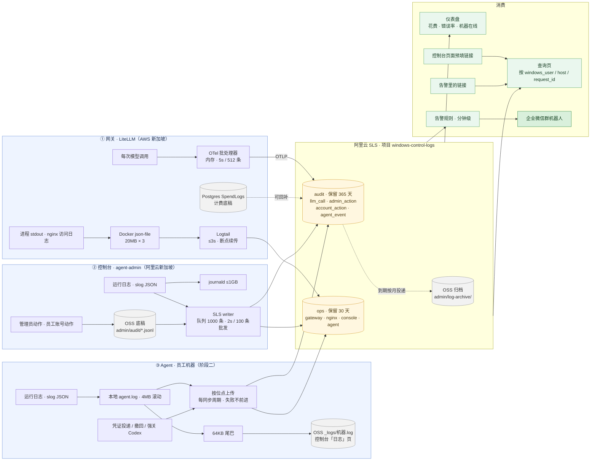

# 设计：三模块统一日志与告警（LiteLLM 网关 / Agent / Agent-admin 控制台）

> 2026-09-08 · 上位文档 `架构_整体架构总览_2026-07.md`（rev.5）
> 相关文档 `架构_Codex多模型网关_2026-08.md`、`设计_员工账号管理与用量限制_2026-09.md`、`企业微信集成.md`（调研）
>
> **要解决的问题**：三个模块的日志各自为政，除网关计费记录和员工账号审计外全部滚动覆盖，没有统一时间线、没有告警。
> 员工报"Codex 不好用"时，管理员要分别登三处、凭时间猜关联。

## 0. 结论先行

- **落点**：阿里云日志服务 SLS，新加坡（ap-southeast-1，与 OSS、控制台同区）。不加服务器。
- **两个 logstore**：`ops`（运行日志，热存 30 天）、`audit`（审计与计费，热存 365 天）。
- **一条请求一个 ID**：`request_id` 把网关的计费记录、容器日志、Bedrock 调用串起来；Agent 不在请求路径上，用 `windows_user + 时间` 与网关记录关联（§2.4）。
- **告警四条起步**，发企业微信群机器人。
- **分两阶段**：阶段一网关 + 控制台 + 告警（不动员工机器，2–3 天）；阶段二 Agent 结构化日志直写 SLS（随下一版 agent 发布）。
- **流转与丢失边界**见 §2.5：审计先写底稿再写 SLS，SLS 不是唯一真相。
- **OSS 不退场**：员工账号审计文件、agent 日志尾巴照旧，作为不依赖 SLS 的底稿；SLS 是查询与告警面。

## 1. 已确认的事实（设计依据）

2026-09-08 实测：

| 事实 | 结论 |
|---|---|
| 网关 LiteLLM 镜像含 OpenTelemetry 回调与 OTLP/HTTP 导出器，含 S3 回调，**无**通用 webhook 回调 | 计费记录走 OTLP 直发 SLS |
| 网关 EC2（AWS 新加坡）到 `ap-southeast-1.log.aliyuncs.com` HTTPS 可达 | 跨云直写可行 |
| 控制台主机在 ap-southeast-1，装有 `aliyun` CLI 但未配凭证 | 建项目需要一个有 `log:*` 权限的 AccessKey |
| 三模块目前全是 `log.Printf` 纯文本；控制台审计行前缀 `[audit]`；agent 本地 4 MB 滚动 + 64 KB 尾巴到 OSS `_logs/` | 要加结构化字段才能关联 |
| Agent 的 RAM 策略只放行 OSS 四个前缀 | 直写 SLS 需新增一条 `log:PostLogStoreLogs`，限定 `ops` 一个 logstore |
| 日志量：网关测试期数百条/天，容器日志 25 KB/小时活跃期 | 三模块合计每月几十 MB，SLS 月费用几十元量级 |
| 企业微信集成仅有调研文档，无代码 | 告警用 SLS 原生的企业微信机器人通道，不写代码 |

**未验证（实施时第一步核）**：SLS OTLP 接入的 header 名称；Logtail 在非阿里云主机（AWS EC2）上的用户标识配置；无影云机器出网到 `*.log.aliyuncs.com` 是否放行。

## 2. 日志分层与字段

### 2.1 两个 logstore

| logstore | 内容 | 保留 | 写入方 |
|---|---|---|---|
| `ops` | 进程运行日志、nginx 访问、agent 同步过程、hook 警告 | 30 天 | 三模块 |
| `audit` | 每次模型调用的计费记录；管理员动作；员工账号动作；agent 上的凭证投递 / 撤回 / 强关 Codex 事件 | 365 天 | 网关、控制台、agent |

### 2.2 公共字段（每条都有）

`ts`、`module`（gateway / agent / console）、`host`（主机名或机器名）、`level`、`msg`、`request_id`（有则填）、`windows_user`（有则填）。

### 2.3 `audit` 的记录类型

| type | 关键字段 | 来源 |
|---|---|---|
| `llm_call` | request_id、model、windows_user（由 key 别名 `emp-*` 推出）、input_tokens、output_tokens、cache_read_tokens、cost_usd、latency_ms、status、error_type | 网关 OTel 回调 |
| `admin_action` | action（publish_agent / publish_codex / bind / unbind / …）、target、client_ip | 控制台 `[audit]` 行 |
| `account_action` | action（onboard / offboard / quota / models / reissue / profile）、windows_user、detail | 控制台，与 OSS `admin/audit/<user>.jsonl` 同源双写 |
| `agent_event` | event（creds_placed / creds_revoked / tools_restarted / codex_killed）、windows_user、files | agent（阶段二） |

### 2.4 request_id 的贯穿

- Codex 请求到网关时，LiteLLM 生成 `litellm_call_id`；hook 把它写进响应头 `x-litellm-call-id`（LiteLLM 已有此行为，实施时核对）。
- 阶段二 agent 不参与请求路径（它不代理 Codex 流量），所以 agent 日志用 `windows_user + 时间` 与网关记录关联，不用 request_id。request_id 只在网关内部串 OTel 记录与容器日志。
- 排障路径：员工报问题 → 控制台「员工账号」详情页加一个「最近 24 小时调用」链接，跳到 SLS 查询页按 `windows_user` 过滤 → 看 `llm_call` 的 status / error_type → 需要时按 request_id 查 `ops` 里网关那一刻的日志。

## 2.5 日志流转（端到端）

**各段的行为约定**

| 段 | 延迟 | 断网 / SLS 不可用时 | 丢失边界 |
|---|---|---|---|
| 网关 OTel → audit | 秒级 | 导出器重试 3 次后丢弃该批；Postgres SpendLogs 仍有完整记录 | 最多丢一批（≤512 条）的 SLS 副本，可从 SpendLogs 回补 |
| Logtail → ops | ≤3 秒 | Logtail 本地断点续传，Docker 文件轮转前（60MB）都能补 | 超过轮转窗口才丢 |
| 控制台 → ops/audit | 秒级 | 队列满 1000 条后丢弃最旧的运行日志；审计写失败记一条 ops 错误，动作不回滚；OSS 底稿已写 | 审计不丢（OSS 有），运行日志可能丢 |
| Agent → ops | 一个同步周期（默认 15 分钟） | 位点不前进，下周期补发；本地 4MB 滚过则丢 | 离线超过约 4MB 日志量才丢 |
| Agent → OSS 尾巴 | 一个同步周期 | 照旧 | 只保留最近 64KB |

**写入顺序原则**：凡是审计类记录，先写不依赖 SLS 的底稿（网关是 Postgres，控制台是 OSS 文件），再写 SLS。SLS 是查询与告警面，不是唯一真相。

**读取路径**：管理员只从三个入口进 SLS——控制台页面上的预填链接、企业微信告警里的链接、SLS 控制台的保存查询。不直接登服务器看文件。

**归档**：`audit` 365 天到期后由 SLS 数据投递任务按月导出到 OSS（`admin/log-archive/audit/YYYY-MM.jsonl.gz`），再保留视合规要求；`ops` 到期直接清理。

## 3. 三个模块各改什么

### 3.1 网关（阶段一）

- `config.yaml`：`litellm_settings.callbacks` 加 `otel`；环境变量 `OTEL_EXPORTER_OTLP_ENDPOINT` 指向 SLS 的 OTLP 地址，`OTEL_EXPORTER_OTLP_HEADERS` 带项目、logstore 与 AccessKey（AK 只进 `.env`，600 权限）。
- `custom_callbacks.py`：hook 已有 `_capture`；加一处把 `windows_user`（从 key 别名）与 request_id 写进 OTel span 属性，并把丢弃 apply_patch / 内置工具的警告作为结构化事件发 `ops`。
- 容器日志与 nginx：一个 Logtail（AWS 主机按"自建机器"接入），采 Docker json-file 到 `ops`，字段：container、stream、msg。
- 不改的：Postgres 里的 SpendLogs 照旧，作为 SLS 之外的计费底稿；UI 的 Logs 页照旧。

### 3.2 控制台（阶段一）

- 日志层：`log.Printf` 换成 `log/slog` JSON handler，输出到 stdout（journal 照收）；同时一个 SLS writer 把 JSON 行按级别分发到 `ops` / `audit`。SLS 的 AK 走环境变量 `AIENVMGR_SLS_AK_ID/SECRET`，与网关管理密钥同一种注入方式（systemd drop-in）。
- 审计：现有 `[audit]` 行与 `admincore.appendAudit` 各加一次 SLS 写入（`admin_action` / `account_action`）。OSS 文件仍写，SLS 写失败只记 `ops`，不影响动作（沿用审计"永不阻塞"原则）。
- 页面：员工详情页加「在 SLS 查看最近调用」链接（预填 `windows_user`）；机器页加「在 SLS 查看该机日志」链接（预填 `host`）。
- journald：给 `journald.conf` 设 `SystemMaxUse=1G`，当前已占 520 MB 无上限。

### 3.3 Agent（阶段二）

- 日志层：同样换 `slog` JSON，本地 `agent.log` 格式随之变为 JSON 行（控制台「日志」页的错误 / 提示提取逻辑要同步适配）。
- 上传：每个同步周期，把上次上传位点之后的新行 POST 到 SLS `ops`（`log:PostLogStoreLogs`，一个 logstore）；四类 `agent_event` 另写 `audit`。失败不重试超过一次，下个周期再补（位点不前进）。
- 凭证：agent 已持有一对 RAM AK（写 OSS 用），给这对 AK 加一条 SLS 权限即可，不新增凭证。
- OSS 尾巴照旧上传，控制台「日志」页不改；SLS 是完整历史，OSS 是最近 64 KB 兜底。
- 发布：随下一版 agent（1.2.13+）发布；未升级的机器只有 OSS 尾巴，对账页面用 `agent_version` 字段能看出谁没升。

## 4. 告警（阶段一）

SLS 告警规则 → 企业微信群机器人（客户 IT 建机器人给 webhook）。起步四条：

| 规则 | 条件 | 级别 |
|---|---|---|
| 网关失联 | `ops` 中 5 分钟无 gateway 记录，且 SLS 主动探测 `https://litellm.teenet.app/health/liveliness` 失败 | 高 |
| 机器失联 | 某 `host` 超过 2 个同步周期无 agent 记录（阶段二前用控制台的机器页状态代替） | 中 |
| 花费预警 | 某 `windows_user` 当日 `cost_usd` 之和超过其月预算 80%（预算数由控制台每日写入 `audit` 一条 `quota_snapshot`） | 中 |
| 上游错误率 | 5 分钟内 `llm_call` 的 `status=error` 占比 > 10% 且样本 ≥ 10 | 高 |

告警文案带 SLS 查询链接。静默时段与升级路径不在本期。

## 5. 权限与凭证

| 主体 | 凭证 | 权限 |
|---|---|---|
| 网关 OTel 导出 | 专用 RAM 用户 AK，`.env` 600 | `log:PostLogStoreLogs` 于 `audit`、`ops` |
| 网关 Logtail | 同上或 Logtail 用户标识 | `ops` |
| 控制台 | 专用 RAM 用户 AK，systemd drop-in | `log:PostLogStoreLogs` 于两个 logstore |
| Agent | 现有 agent RAM AK 加一条 | `log:PostLogStoreLogs` 于 `ops`、`audit` |
| 管理员查询 | 各自的阿里云 RAM 登录 | `log:Get*` / `log:List*` 于该项目 |

原则不变：员工机器上不落新凭证；AK 都不进代码、不进日志。

## 6. 成本

写入量每月几十 MB，`ops` 30 天、`audit` 365 天，索引开全字段。按 SLS 新加坡目前定价，月费用在几十元人民币量级；企业微信机器人免费。若日后接入更多机器（百台级），主要增量在 agent 的 `ops`，仍在百元内。

## 7. 分阶段落地与验收

**阶段一（网关 + 控制台 + 告警，预计 2–3 天）**
1. 建 SLS 项目 `windows-control-logs`、两个 logstore、索引、两个 RAM 用户。
2. 网关：OTel 回调上线 → 在 SLS 看到 `llm_call` 记录，字段齐全；Logtail 采到容器日志。
3. 控制台：JSON 日志 + SLS 双写上线（console web-32）→ 做一次开户，在 `audit` 里看到 `account_action`，OSS 文件同时有。
4. 四条告警配好 → 人为制造一次上游错误（调用一个不存在的模型 12 次），企业微信群收到告警。
5. 验收：任选一个员工的一次调用，从企业微信告警 / 详情页链接 → SLS `llm_call` → 同 request_id 的 `ops` 记录，一分钟内能走完。

**阶段二（Agent，随 agent 下一版）**
6. agent JSON 日志 + SLS 上传；控制台「日志」页适配 JSON。
7. 验收：停一台机器的 agent，两个同步周期后收到「机器失联」告警；恢复后 SLS 里能看到断档前后的记录。

## 8. 不做的事

- 不自建 Loki / ELK；不复用控制台主机上 RAGFlow 的 Elasticsearch。
- 不做 Codex 请求体抓包常态化（`GATEWAY_CAPTURE_DIR` 仍只在排障时临时开）。
- 不做多管理员身份，`admin_action` 只记客户端 IP。
- 不做 AWS 侧 CloudWatch 对接（网关计费以 SLS 里的 `llm_call` 为准，与 AWS 账单月度人工对账，见网关 README 2026-09-08）。
