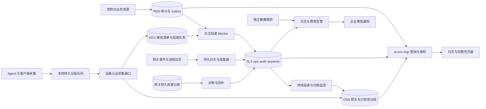

# 设计：ai-env-mgr 统一日志、会话归档与告警

> 更新：2026-09-09 · rev.2，替代 2026-09-08 的三模块接入草案。  
> 状态：目标设计与分阶段实施依据，不表示已上线；本文不修改生产配置。  
> 范围：模型网关（当前 LiteLLM）、Windows Agent、ai-env-mgr 控制台及受管 AI 客户端。  
> 上位文档：[整体架构](架构_整体架构总览_2026-07.md)、[RDS 升级](架构_RDS升级与统一控制面_2026-09.md)。  
> 相关文档：[网关架构](架构_Codex多模型网关_2026-08.md)、[员工账号与用量](设计_员工账号管理与用量限制_2026-09.md)、[企业微信集成](ai-env-mgr/docs/企业微信集成.md)。

## 0. 决策与目标

**ai-env-mgr 是统一查询入口，SLS 负责日志检索和告警，OSS 保存完整文件与长期归档，RDS 保存业务状态、业务审计及采集进度。** 管理员在控制台内完成查询、关联排障、会话查看和诊断包导出；SLS 控制台作为授权运维人员的高级入口。

日志覆盖管理、授权、设备、任务、发布、模型调用、协议转换、会话与工具执行。在明确采集范围内尽可能保存所有事件，截断、丢弃、上传积压和无法采集必须可见。日志产生前、首次持久化前、磁盘损坏或设备永久丢失时不能承诺零丢失。

SLS 项目暂定 windows-control-logs，地域新加坡，与原稿的 OSS、控制台部署记录一致，实施前核对实际地域与网络。优先复用现有主机，是否增加采集资源由压测决定。

第一阶段接入 ops、audit 两个 Logstore，完整会话阶段增加独立授权的 sessions。RDS、Agent 协议、网关替换分别发布，避免同时切换。

## 1. 证据状态与待验证项

| 项目 | 证据状态 | 本版处理 |
|---|---|---|
| 网关镜像包含 OTel、S3 回调；AWS 到 SLS HTTPS 可达 | 原稿记载为 2026-09-08 实测，本次未复测生产 | 不能由此推断鉴权、字段映射和可靠投递完成 |
| Agent 约 4MB 滚动文件、64KB 尾巴上传 OSS | 原稿部署记录 | 保留过渡诊断，不称为完整历史或可靠队列 |
| 控制台审计通过 OSS 读改写追加 | 已检查 ai-env-mgr/go/internal/admincore/audit.go | 读写失败会放弃记录，存在并发覆盖风险，不能宣称审计不丢 |
| SpendLogs 可作计费底稿 | 原稿记录，实际覆盖待核对 | 核对数据库启用、写入时机、失败/取消覆盖、保留期、采样及回补字段 |
| 企业微信只有集成调研 | 原稿记录 | 验证当前产品、账号和地域的通知能力、机器人鉴权和投递结果 |
| 每月几十 MB、百台仍不足百元 | 测试期外推 | 未覆盖完整会话，不能作为生产预算 |

实施前记录网关镜像 digest、客户端/Agent 版本、OTel 与采集器版本及配置摘要。分别验证 AWS 到 SLS、Windows 到采集接口、控制台到 SLS/OSS 的网络和权限。

OTLP 原型必须验证信号类型、endpoint、鉴权、目标存储、字段映射和查询结果。不能假设 LiteLLM span 自动成为 audit 中的一条 llm_call，也不预先写死“headers 带 AK 即可”。产品入口可能调整，应锁定具体接入方式。[阿里云 OpenTelemetry 接入说明](https://help.aliyun.com/zh/opentelemetry/user-guide/tutorials/)

## 2. 数据分工、采集范围和保留

### 2.1 存储职责

| 存储 | 内容 | 建议初始保留与定位 |
|---|---|---|
| RDS | 员工、设备、绑定代次、任务、业务审计、outbox、上传确认、归档清单、导出任务 | 按业务生命周期管理，不存运行日志全文 |
| SLS ops | 进程、同步、发布、访问日志、错误、协议转换事件 | 近期 30 天查询；归档按事件类别决定 |
| SLS audit | 管理审计副本、授权事件、规范化调用用量、重要设备操作 | 30 天热查询；365 天可追溯目标通过分层存储或 OSS 实现，不默认全年全热存 |
| SLS sessions | 逐条消息、工具事件及可检索内容分段 | 初期 30 天，独立权限；大内容存摘要、分段索引和 OSS 引用 |
| OSS | 原始会话、完整工具输出、补丁、附件、诊断包、历史日志 | 会话原文先按 90 天评估，审计归档按 365 天评估；上线前确定正式期限 |

上述期限是设计初值。保留策略修改需审计；到期清理覆盖 SLS、OSS 原文/附件、索引及导出文件，备份按独立周期到期。恢复旧备份不得重新发布已删除内容。需要延长保留的对象应在过期前执行保留任务。

索引优先覆盖身份、时间、类型、状态和关联 ID；需要全文搜索的内容在 sessions 中分段索引。不默认全字段索引，“原文完整保存”与“全部内容即时全文检索”分别验收。

### 2.2 事件目录

| event_type | 记录内容 | 来源与边界 |
|---|---|---|
| admin_action | 操作者、动作、对象、前后值、原因、结果、任务 ID；敏感内容查看与导出 | 控制台业务审计 |
| account_action | 开通/停用、绑定、权限、额度、令牌轮换与撤销各步骤结果 | 控制台/Worker；令牌仅存引用 |
| agent_event | 启停、心跳、版本、同步、配置应用、凭据投递/撤回、工具重启、异常 | Agent |
| task_event / release_event | 步骤、尝试次数、下载校验、安装、健康检查和回滚 | Worker 与 Agent，共用 task_id |
| llm_attempt / llm_call | 请求与实际模型、端点标识、状态、错误来源、耗时、用量、费用估计、重试/fallback | 网关；每次尝试与请求汇总分开 |
| protocol_transform | 入站/出站协议、转换器版本、工具类型、字段转换/删减、结果 | 网关；默认记录差异摘要 |
| session_message | 用户输入、模型实际返回内容、消息版本、附件引用、完成/中断状态 | 客户端事件或会话文件 |
| tool_call / tool_result | 工具名、脱敏参数、审批结果、调用 ID、输出引用、错误 | 客户端；网关只能看到协议中回传的部分 |
| file_change / command_result | AI 发起的补丁或可获得差异、命令、工作目录、退出码、输出 | 受管客户端，不扩展为全机用户活动监控 |
| platform_event / collection_gap | API、数据库、OSS、SLS、采集器故障、缺失范围与原因 | 各模块及独立采集健康检查 |

标记事件来源和完整性：客户端记录、网关观察与 Agent 验证不能混为一谈。模型未返回的内部推理不可采集。维护各客户端版本的采集能力矩阵；缺少执行前快照时不能承诺还原所有文件差异。

结构化会话采集是正式能力；完整 HTTP 抓取是有期限、容量限制和权限控制的排障能力，落盘前脱敏。不因为关闭常态抓包而省略会话与工具记录。

## 3. 事件结构、关联与去重

### 3.1 公共字段

必填：schema_version、event_id、event_type、occurred_at、module、source_id、level、message。接收端添加 received_at，记录来源版本、采集策略版本、完整性标记及原文引用。时间统一 UTC，界面按用户时区展示。

按上下文填写 employee_id、device_id、binding_epoch、session_id、task_id、request_id、attempt_id、tool_call_id、actor_id。不适用字段留空，不编造关联。windows_user、主机名和 key 别名只用于展示和辅助搜索。

设备事件增加 boot_id、stream_id 和单调 sequence，识别重复、缺口和来源内顺序。保留发生与接收时间，离线补传不能显示成刚发生的操作。

### 3.2 关联规则

控制台创建 task_id，随命令下发，由 Agent 回执。采集接口根据设备认证绑定来源；历史员工归属按当时 binding_epoch 解析，不按设备当前使用者回填。

网关生成逻辑 request_id，每次上游尝试分配 attempt_id，保留 upstream_request_id（若返回）。litellm_call_id、trace_id、响应头先验证含义再建立映射，不假设它们相等或可贯穿 Bedrock 内部。

员工身份从可信令牌记录映射，不仅由 emp-* 别名推导。device_id、session_id 只有在客户端与认证链可靠提供时才关联；共享员工令牌不能证明请求来自哪台设备。用户名加时间只能辅助筛选，关联不足时明确标记。

### 3.3 去重与计费口径

event_id 在源端生成，重发保持不变。采用至少一次交付，SLS 不充当唯一键数据库。查询视图与统计按 event_id 或明确的业务唯一键去重，验证跨页查询和聚合不会重复累计。

调用开始、结束和用量修正各有事件 ID，通过 request_id、attempt_id、revision 关联；只统计最终有效版本，请求汇总与 attempts 不同时求和。记录币种、价格版本、费用来源及 estimated/confirmed 状态，未知费用不能当零。

网关持久用量记录是内部对账依据，覆盖与准确性须验证；厂商账单是上游实际结算依据。SLS 是查询与预警副本，不作为扣款或绝对预算硬限制的唯一依据。

## 4. 端到端流转和可靠性

### 4.1 控制台与审计

RDS 阶段，业务变更、审计、outbox 在同一事务提交。外部网关/设备操作由持久任务执行，分别记录“已请求”和“已确认生效”，不在事务内等待 SLS 或外部网关。

SLS 不可用不阻塞业务，不等于底稿失败也放行。权限扩大、密钥发放等操作无法持久记录意图时拒绝开始。紧急撤销优先收回访问，可使用受保护的本地持久应急记录，恢复后补账；应急记录也失败时显式报告审计缺口。

RDS 尚未迁移时，以本地持久事件队列及按事件 ID 保存的独立 OSS 对象过渡，保留旧 JSONL 供旧页面读取。过渡期不能保证 OSS 业务状态与审计事务一致，通过意图/结果对账暴露缺口，不宣称审计不丢。

运行日志使用 slog JSON 写持久日志，由采集器上传。分流按事件类别，不仅按 level；不再设计仅靠内存队列、却承诺可靠双写的 SLS writer。

### 4.2 网关

验证实际镜像回调，生成规范化事件，优先从持久结构化日志采集到普通 Logstore。OTel 是链路诊断候选，是否增加专用 traces 存储由原型决定，未验证前不能把 span 当计费审计。

覆盖鉴权/路由拒绝、上游失败、流开始后失败、取消与超时，不只记录成功 completion。用量底稿只能回补实际保存的字段，不能补回未保存的提示词、流片段或转换细节。

定时比较调用事件、底稿与 SLS，回补缺失并去重。核对底稿异步落盘窗口，崩溃前未持久化的数据仍可能丢失。OTel 批大小、周期和重试次数不是累计丢失上限，不保留“最多丢一批”的承诺。

### 4.3 Agent、客户端和接收确认

采集上传与配置同步解耦，建议在线时每 10–30 秒批量上传，重要事件尽快调度，不依赖 15 分钟同步周期。批大小、限速、时延经过试点校准。

本地以独立分段保存事件，记录段号、stream_id、序号范围、大小和校验值；确认位点原子持久化。重启扫描未确认段恢复，处理轮转、半行、截断和文件替换，不只保存 agent.log 字节偏移。重要事件明确持久化策略并测量业务开销。

上传经过设备认证接口，按来源和段 ID 幂等处理。原文落 OSS 并验证、RDS 接收清单和投递任务提交后，才确认“已接收”；不等待 SLS 建索引。“已接收”“已索引”“已归档”是不同状态。确认丢失时重传相同段，返回已有确认结果。

OSS 已写而清单失败的孤立对象由对账处理，清单不能指向未保存对象。各目标有独立投递状态，不能 ops 成功就推进 audit 的位点。永久非法事件进入可查看的隔离队列，不卡住后续事件、不静默删除。

未确认段不正常轮转删除，缓冲必须有磁盘上限。接近上限先告警，优先保护审计及重要事件，不能耗尽系统盘；不得不丢弃时报告范围、数量、类型和原因，恢复后补报，不能承诺这部分可恢复。

旧 Agent 的 64KB OSS 尾巴继续可读，并标记“仅日志尾部”。客户端消息增量采集，后续请求携带的旧历史不重复记作新消息。

### 4.4 完整性与丢失边界

| 情况 | 行为和限制 |
|---|---|
| 网络/SLS 暂时不可用 | 持久队列积压、退避重试，恢复补传，受容量与保留期约束 |
| 进程退出 | 恢复已持久化数据，未落盘内容仍可能丢失 |
| 磁盘损坏/设备永久丢失 | 未确认片段可能无法恢复，显示最后确认位点 |
| 轮转/队列满 | 队列与普通日志轮转分离，超限丢弃必须可见 |
| 成功后确认丢失 | 保留相同 ID 重试，页面和统计去重 |
| 采集器停摆 | 独立心跳结合预期设备清单检测，不将未采集显示成无事件 |

完整性页面显示各来源能力和版本、最近心跳、事件/接收/索引时间、待传数量/字节、最旧积压、磁盘占用、缺口、截断、回补与归档进度。失联时显示最后已知状态。按段/序号或查询探针确认索引进度，不能仅根据写入返回成功宣称已可查。

## 5. ai-env-mgr 日志中心

新增“日志与诊断”入口：全局日志、调用记录、会话与工具、管理审计、采集健康、导出任务。员工、设备和任务详情进入同一套已筛选视图。

支持时间、员工、设备、模块、类型、模型、状态及关联 ID 过滤；详情展示时间线、原文、工具输出、协议差异和版本。关联不确定时显示依据，摘要与大内容分开加载。

后端完成身份和对象范围校验，再调用 SLS 查询及 OSS 读取；管理员不需要单独登录阿里云。[GetLogs 接口](https://help.aliyun.com/zh/sls/developer-reference/use-getlogs-to-query-logs-46)

使用允许的查询字段、规范化转义、时间窗口限制、分页和超时；普通用户不能提交任意 SQL 或 OSS key。结果不完整、索引延迟必须可见。大导出采用持久任务，设置行数/字节上限、有效期和下载审计。

近期查 SLS；历史由 RDS 清单定位员工/会话/时间分段，再读 OSS。跨全年任意关键词搜索需延长索引留存或异步重建指定范围索引，不能假定 OSS 提供同等全文搜索。归档层恢复等待在页面可见。

会话“回放”只展示事件，不执行命令或工具。长输出支持分段加载及下载，显示完整、截断、未上传或恢复中状态。诊断包默认包含必要错误和版本链，脱敏且不默认打包全部员工会话。

## 6. 持续归档与恢复

SLS 在保留期内持续投递 OSS，按日期、Logstore 和唯一分片组织对象，不等到过期后启动，也不假设每月只有一个固定名称文件。大附件、原始会话直接入 OSS。

监测投递失败和最旧未归档时间，在接近过期前修复或延长保留。SLS 生命周期不会等待业务清单确认，必须主动监测。定期抽样下载、校验和演练恢复。官方要求延迟投递小于源 Logstore 的保留期并留缓冲。[投递限制](https://help.aliyun.com/zh/sls/oss-stability-description-and-usage-restrictions)

归档清单记录对象、来源时间范围、段范围、校验值、保留到期和验证时间。投递对象清单异步登记，不要求每条运行日志在 RDS 中占一行。

## 7. 告警与通知

| 规则 | 条件口径 | 验证方式 |
|---|---|---|
| 网关不可用 | 独立定时健康探测连续失败，区分服务与采集故障 | 测试环境停服务/阻断探测，确认恢复通知 |
| 设备失联 | 基于预期在线设备清单的心跳超时，排除维护/退役 | 停 Agent 并恢复 |
| 预算预警 | 当前 budget_period_id 内去重累计费用达到周期预算 80% | 跨日、重置、额度变更、重复事件测试 |
| 上游错误率 | 5 分钟实际 attempt 错误率 >10%，样本至少 10，按路由分组 | 可控上游 5xx/超时；不存在模型另测路由错误 |
| 采集/归档异常 | 心跳停止、积压超目标、发生丢弃、逼近过期 | 断 SLS、停 Worker、模拟队列满/归档失败 |

阈值为试点初值，低流量下另测连续失败。配额快照含预算周期、时区、有效时间与版本，变更时推送并定期对账；迟到费用更新统计，历史回补不重复触发过期告警。

主动探测由独立任务或已验证云探测服务提供，不假设 SLS 查询规则自动执行 HTTP 探测。关键采集故障需有不依赖同一 SLS 写入链的通知路径。

企业微信为首选通道，按规则、对象、故障周期去重，支持冷却时间、维护窗口、恢复通知及发送失败状态。告警链接默认回 ai-env-mgr，访问仍需授权，消息不携带会话原文或秘密。

## 8. 权限与秘密处理

| 主体 | 身份方式 | 边界 |
|---|---|---|
| 管理员 | 独立登录身份与角色 | 运维摘要、审计、会话原文、导出分别授权 |
| 查询后端 | 服务端角色或专用受限凭据 | 只读指定 SLS 数据及获准 OSS 对象 |
| Worker/网关采集器 | 独立写入身份，优先托管/短期凭据 | 只写各自目标，无查询、删除、管理权限 |
| Agent | 独立设备认证到采集接口 | 服务端绑定来源，不能覆盖其他设备身份 |
| 归档任务 | 专用投递角色 | 只读指定源、只写指定 OSS 前缀 |

不把共享 Agent OSS AK 扩权作为目标。过渡期若保留共享 AK 直写，标记来源未经可靠验证，不作为授权/自动控制依据，明确退出步骤与密钥轮换。最终 Agent 无全局 SLS 查询或管理密钥。

AK、Authorization、Cookie、密码、令牌、凭据文件内容在落盘前过滤，服务端再次检查。异常、参数、工具输出和抓包共用脱敏规则，不只过滤 headers。必要的秘密指纹避免使用可枚举的低熵裸哈希。

审计记录必要前后变化，秘密仅存引用或变更事实。查看原文、导出、修改留存均留审计，试点单管理员也要有唯一 actor_id；IP 仅作辅助。日志加密、备份和恢复权限独立管理。

## 9. 分阶段实施与验收

### 阶段一：集中运行日志和基础告警

锁定版本与样本，建立 ops/audit、必要索引和受限身份。网关与控制台输出统一事件，建立持久底稿和回补；OTel 先验证，不作为唯一接入方式。旧 Agent 标明只有尾部日志。

先提供调用/错误查询和告警，SLS 跳转可作临时入口。出口：成功、失败、取消可区分，底稿可核验，断连恢复可回补，费用不会因重投重复累计。不能以此阶段宣称完整日志中心已交付。

### 阶段二：控制台查询和可靠设备采集

实现后端查询授权、员工/设备/任务时间线、管理员身份、完整性页面。配合 RDS 实现事务审计和 outbox，Agent 使用认证接口、分段队列及接收确认；上线持续归档、回补和诊断导出。

出口：主要排障不需登录阿里云；重启、轮转、离线、确认丢失可恢复；越权被拒绝、缺口可见。RDS 未完成时单列过渡边界，不冒充事务一致性。

### 阶段三：完整会话和历史检索

按客户端版本验证能力，接入 sessions 与 OSS 原文/附件，提供全文搜索、只读回放、长输出查看、归档恢复。先验证一个客户端再扩展，记录每个版本实际覆盖事件。

出口：对合成任务核对消息、模型返回、工具调用/结果、文件修改及中断状态，每项有记录或缺失原因；内容权限、留存删除和容量费用验证通过。

### 故障验收矩阵

| 场景 | 必须证明 |
|---|---|
| SLS 中断与重投 | 覆盖范围内可补回，重复不影响费用/时间线 |
| 业务事务失败 | 业务和审计一起回滚，外部操作由任务对账 |
| 上传成功但 ACK 丢失 | 同段重传不产生第二份逻辑事件 |
| 重启、轮转、半行、截断 | 正确恢复，无法恢复范围明确 |
| 磁盘满/非法事件 | 告警、隔离、丢弃统计明确，不卡死队列 |
| 换人换机/时钟偏差 | 历史归属不随当前绑定变化，顺序可解释 |
| 重试/fallback/取消/迟到用量 | attempt 可区分，取消不等于未计费，费用可修正 |
| 归档暂停逼近过期 | 及时告警、校验恢复，已过期缺失可见 |
| 越权查询/导出 | 后端拒绝，原文引用不能绕过权限 |
| 测试秘密出现在错误/输出中 | 脱敏及诊断包检查通过 |

### 发布、回滚与估期

固定客户端版本按试点设备逐步发布，schema_version 支持前一版本。回滚不删除未确认队列；旧 Agent 不认识新段时保留，由兼容工具恢复。演练协议回退、RDS 恢复后的去重与告警恢复。

原稿“2–3 天”仅是基础接入原型的历史估算，不能覆盖可靠补传、RDS 事务、内嵌查询及完整会话。每阶段在样本和原型后单独估工期、负责人及退出条件。

## 10. 容量、费用与待定参数

采集至少一周代表性负载：空闲、正常任务、长会话、大输出、异常重试。分别测每日原始写入量、索引/全文比例、压缩归档、附件、查询/导出流量和本地磁盘。

按“设备数 × 每设备各类事件量 + 网关/控制台事件量”估算，考虑重复投递及增长。消息增量存储，完整抓取按需开启，不能用 stdout 大小外推全部会话。

费用包含 SLS 写入/索引/分层保留（依计费模式）、OSS 存储/请求/恢复、跨云与外网读取、采集资源及维护。按写入数据量模式以原始写入计量，官方说明含前 30 天存储权益；地域、规格和附加费用实施时核价，压缩传输不等于原始写入费用减少。[SLS 计费说明](https://help.aliyun.com/zh/sls/billing-per-amount-of-data-written)

上线前确定各类保留期限、索引范围、事件/分段上限、本地队列容量、上传限速、可查询时延、离线缓冲目标、归档阈值、预算周期/时区、角色权限和采集版本。参考目标为在线 1 分钟内可查、离线 24 小时可缓冲，必须在规定负载及磁盘预算下测量，不作无条件保证。

## 11. 范围边界

不自建 Loki/ELK，不复用 RAGFlow Elasticsearch。本次不更换网关或修复 LiteLLM 协议，只记录可诊断的转换事实。

不把回放变成工具重执行，不把日志统计当实时授权或硬预算系统，不记录模型未返回的内部推理。结构化会话采集与常态抓包分别管理。

AWS CloudWatch 非第一阶段必需依赖；保留厂商账单对账，后续是否自动接入由对账缺口决定。SLS、网关记录和上游账单用途不同，不能互相替代。

## 阶段一验收记录(2026-09-12)

上线内容:SLS 项目 `windows-control-logs`(ops 30 天,audit 365 天热存 30 天);控制台 web-34 带 `--log-dir`;网关 `llm_call` 事件回调;控制台主机独立探测;两台主机 Logtail。告警规则文件就绪,等企业微信 webhook 后下发。

| 场景 | 做法 | 结果 | 已知边界 |
|---|---|---|---|
| 采集中断与补传 | 停网关主机 ilogtaild 约 2 分钟,期间产生 5 条 llm_call,再启动 | 5 条全部入库,按 event_id 各出现 1 次,无重复 | 本地文件 50MB×5 轮转之外的积压会丢;超过该窗口的中断未测 |
| 端到端时延 | 探测事件每分钟一条 | SLS `__time__` 与 `occurred_at` 一致,入库延迟 1 分钟内 | 采集配置刚下发时会回读文件已有内容 |
| 成功/失败/取消可区分 | 主密钥成功调用、不存在模型、流式请求 2 秒后掐断 | 成功、失败各一条,字段完整;掐断的流式请求**无任何事件** | LiteLLM 对客户端断开不触发回调,取消事件阶段一采不到;其费用是否计入 SpendLogs 待核 |
| 费用与预算字段 | 临时员工用户(预算 5 美元)调用一次 | `employee_id`、`key_alias`、`user_max_budget=5.0`、`user_spend`、`cost_usd` 均正确 | 预算取用户级字段;失败请求费用记 0.0(estimated),非 null |
| 秘密扫描 | 两台主机日志文件与 SLS 两个库查 `sk-`/`LTAI`/`Bearer`/`Cookie` | 全部 0 命中 | 扫描是模式匹配,不是证明 |
| 控制台上线 | web-34 + `--log-dir` | 单元 `ProtectSystem=strict` 使进程启动即退出,控制台 502 约 70 秒;加 `ReadWritePaths` drop-in 后恢复 | 部署顺序已改为先写 drop-in |

未做:告警触发验证(等 webhook);SpendLogs 与 SLS 对账;网关重启中断请求的事件行为;跨账号 ECS 的 Logtail 用账号标识写入,RAM 最小权限子用户未建。
