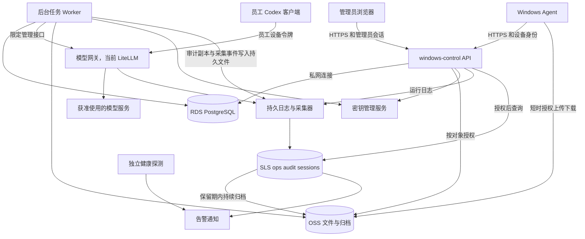

# RDS 升级与统一控制面架构

> 日期：2026-09-06 · rev.3 修订 2026-09-12（含 5 处修正与 3 项决定）  
> 状态：升级设计稿，作为后续实施和验收依据；不代表已完成迁移或已验证生产配置。  
> 范围：`ai-env-mgr` / windows-control、Windows Agent、LiteLLM 集成、OSS 分发、会话归集与统一日志。  
> 依据：当前源码（main 至 2026-09-12 web-36）、整体架构、网关设计、员工账号设计、AppLocker 放行设计和统一日志设计。现状判断来自源码和已上线部署，Windows 真机验证覆盖 AppLocker 与凭据投递，其余仍待验证。

## 0. 修订与证据范围

**rev.3（2026-09-12）**：补齐日志查询与投递契约，将可靠采集前置到阶段 2，统一稳定身份、预算周期、令牌轮换和告警故障域。本次仅修订设计并检查本地代码，不重新认证下表的生产部署状态。下表保留 rev.2 的部署记录；未发版项仍为待发布。

### rev.2：纳入 2026-09-06 之后的功能

原稿写于 9 月 6 日，之后一周控制台、Agent、网关和日志都有实质变化，其中一部分已经在 OSS 架构上实现了原稿要求的行为，一部分产生了新的持久化对象和新的权限主体。本节按功能列出变化和它们在目标架构里的落点；正文相应条款已同步修改，修改处标注 **[rev.2]**。

| 功能与部署记录（含待发布项） | 现状实现（OSS 架构上） | 目标架构落点 |
|---|---|---|
| 员工账号管理：开户、关户、额度（月预算、rpm、tpm、并发）、可用模型、重发令牌、基本信息（09-07，web-31） | 名册 `admin/users.json` 增加姓名、部门、额度；LiteLLM 内部用户承载预算与速率，密钥挂在用户下；关户一步完成吊销令牌、删凭据、解绑；每员工一份追加式审计 `admin/audit/<user>.jsonl`（读改写，非事务）；开户默认额度存在设置里 | `employees` 增加姓名、部门；新增 `employee_quotas`；`gateway_grants` 记录 LiteLLM 用户与密钥别名；开户/关户/改额度成为事务 + 持久任务；审计进 `audit_events`；默认额度进 `settings` |
| AppLocker 放行列表与执行模式（09-09，agent 1.2.13/1.2.14，web-32/33） | 策略 JSON 增加 `appLockerAllowPaths`（严格校验：禁止 Windows 树与用户可写树）和 `appLockerMode`（enforce/audit/空）；Agent 每周期重写本机 AppLocker XML，不受策略 ETag 门控；机器状态上报 AppLocker 模式 | `policy_versions` 内容含 AppLocker 段；校验规则留在 `model` 包并在 API 写入时执行；`device_reported_state` 增加 AppLocker 模式与实际生效路径 |
| 采集精确文件白名单：`~/.codex/.codex-global-state.json`（09-09） | Agent 侧写死的允许文件列表；`.codex` 目录不做通配（auth.json、config.toml 含网关令牌） | 采集范围进入策略版本，仍以服务端白名单为准，禁止客户端扩展 |
| 统一日志阶段一（09-12，web-34） | SLS 项目 `windows-control-logs`（ops 30 天 / audit 365 天）；控制台写 `admin.jsonl`（访问日志）和 `audit.jsonl`（审计副本，带 OSS 写入结果）；网关回调写 `llm_call` 事件；控制台主机独立探测网关；两台主机 Logtail 采集；告警规则已备未接企业微信 | 见 §9.4 **[rev.2]**：RDS 是审计权威，SLS 是检索与告警副本；Agent 日志与采集在阶段 2 走 API；SLS 读取身份改为服务端只读身份 |
| 控制台日志页（09-12，web-35） | 用登录 AK 直接查 SLS（需 `AliyunLogReadOnlyAccess`）；按员工、状态、模型、时间筛选；网关探测健康条 | 管理员改为独立身份后，页面改用服务端注入的只读 SLS 身份；查询授权由 API 按角色判断 |
| 删除代员工登录与文件传输；机器、策略总览、模型网关合并为总览页（09-12，web-36） | 不再有 OAuth 代登录流程；不再有 OSS 暂存文件与预签名下载；`Store.SignedURL` 仅发布路径保留 | 原稿关于"仍保留的直接 OAuth 登录"的条款删除；`artifacts` 表只服务发布，不再需要通用文件暂存 |
| 网关只保留 AWS Bedrock，计费与 AWS 对齐（09-08） | 10 个 Bedrock 模型，东京价格；单 worker，无 Redis | §10.2 网络边界不变；用量底稿仍在网关 Postgres，SLS 副本用于查询与预警 |
| Codex `config.toml` 合并修复（分支 `codex-toml-root-keys`，已复审未发版） | 受管字段合并改为 TOML 感知的行扫描，幂等，员工注释保留 | §8.1 "只更新受管字段"的具体实现；发版后作为阶段 0 基线的一部分 |

rev.2 还修改了：§2 问题表（三行已部分解决或补充证据）、§4.2 表结构、§5.1 管理员身份建议、§5.3 删除 OAuth 段、§7.3 离职流程、§9.4 新增、§11 阶段 1/2 清单、§13 待确认参数、§14 相关文档。

## 1. 升级决策

采用 **RDS 保存业务状态与业务审计，SLS 提供日志检索与告警，OSS 保存文件与归档，windows-control 统一提供管理和查询 API** 的架构。

现有 OSS 同时承担员工名单、机器绑定、策略、状态报告、凭据分发和文件存储。功能增加后，应用需要自行实现整份 JSON 的读改写、并发协调、关联查询和故障恢复。升级首先解决这些业务状态管理问题。

关键决策：

1. 员工、设备、绑定、策略版本、任务及审计进入 RDS，成为业务状态的唯一权威来源。
2. Agent 通过设备身份访问 windows-control API，不直连 RDS，不再持有可读取全员凭据的共享 OSS 密钥。
3. 安装包、附件、原始会话分片继续存 OSS；RDS 保存它们的归属、索引、哈希和处理进度。
4. 管理员通过独立身份和角色登录，OSS AccessKey 不再作为后台登录凭证。
5. 数据库事务负责本地状态一致性；对 LiteLLM、OSS 和设备的操作通过持久任务、幂等执行和对账完成。
6. 保留现有 Go 管理端和 Agent 的模块分层，逐步迁移，无需同时重写桌面客户端。

**升级边界：** 引入 RDS 不会自动修复远端令牌未吊销、客户端配置被覆盖、进程被强杀、数据外传或采集不完整等问题。这些行为需要在对应模块中同步调整。

## 2. 现有问题与升级责任

下表区分源码中已存在的行为与必须通过部署核实的条件。严重性取决于实际权限、网络和使用方式。

| 问题 | 当前证据或触发条件 | 升级要求 |
|---|---|---|
| 员工停用没有联动网关吊销 **[rev.2 已部分解决]** | 09-07 起关户一步执行吊销令牌、删凭据、解绑，任一步失败记 `partial` 审计；但三步不是事务，失败后靠人工重试 | 统一离职工作流进入持久任务，分别记录远端吊销、本地清理结果，失败自动重试并对账 |
| Agent 可读取全员凭据 | `dist/ram-policy-agent.json` 授予 `agent_workdir/*/credentials.zip` 读取权限 | 独立设备身份，服务端按有效绑定授权；最终撤销旧密钥 |
| 后台身份与管理能力不对应 | OSS `Verify` 检查列举对象权限；网关调用使用服务端统一管理密钥 | 独立管理员身份、角色及逐操作授权 |
| 读取失败被视为数据不存在 | `LoadUsers`、`CurrentPolicy`、`PublishCredentials` 吞掉部分读取或解析错误 | 明确区分不存在、不可用、损坏；失败时禁止基于空值覆盖 |
| 并发读改写可能丢更新 | 员工名单、策略、凭据和每员工审计 JSONL 都是整对象读改写；控制台已按员工串行化网关开通，但跨进程无保护 | 行级数据、事务、唯一约束和版本检查；审计改为追加表 |
| 配置变化导致重新投递和工具退出 **[rev.2 已部分解决]** | 09-06 起只在登录凭据字节变化时重启工具；代登录删除后该触发实际不再发生，网关令牌轮换或目录变更**不**重启，员工需自行重开 Codex | 按受管字段比较；普通轮换等待客户端重载或安全重启窗口，紧急撤销先吊销；策略见 §8.2 |
| 解绑或换人后旧凭据可能残留 | 无绑定时不再进入原员工的凭据清理分支 | 显式清理任务、绑定代次、设备本地清单 |
| 采集不能证明完整 | 静默窗口后全量读取文件；上传前删除无法补回 | 增量分片、本地持久队列、缺口检测、明确最大允许丢失窗口 |
| 多用户采集状态互相清除 | 一份 `collect-state.json` 被逐用户读取，并清除本次未见路径 | 按设备、用户和源会话隔离游标 |
| 写权限可覆盖历史对象 | 采集写固定对象名；实际版本控制和保留设置尚未核实 | 不可变对象名、受限上传、保留策略和恢复演练 |
| 浏览器限制与任务执行能力存在边界冲突 | 客户端保留终端、插件、MCP；策略脚本限制部分脚本宿主 | 在最终镜像验证有效策略，网络出口独立管控 |
| 更新校验不等于发布者认证 | Agent 从同一渠道取得二进制和 SHA-256 | 独立签名验证、分批发布、健康检查和回滚 |

表内 Go 源码位于 `ai-env-mgr/go/internal/`；权限模板位于 `ai-env-mgr/dist/`。

## 3. 目标架构



### 3.1 组件职责

| 组件 | 职责 | 边界 |
|---|---|---|
| windows-control API | 身份认证、权限检查、业务写入、配置生成、设备同步、文件授权、日志与内容查询、诊断导出 | 不把数据库密码和上游管理密钥下发到员工端 |
| Worker | 消费持久任务、调用 LiteLLM、导出旧格式配置、核验上传、定期对账 | 与 API 共用业务数据库；外部调用不占用长事务 |
| SLS | 日志检索、会话分段索引、统计与告警 | 查询副本；不承担业务授权或唯一计费依据 |
| RDS | 业务关系、版本、目标和实际状态、任务及审计 | 私网可达，按运行、迁移、查询职责划分数据库权限 |
| OSS | 安装资产、附件、原始归档和兼容期配置 | 业务授权由 API 决定；凭据与长期归档隔离 |
| Agent | 本地应用策略、投递配置、执行受限任务、持久化回执和采集队列 | 只能访问本设备获准的员工上下文 |
| LiteLLM | 执行模型授权、令牌有效性与网关侧用量计量 | 令牌实际是否生效以网关为准；不直接修改其内部数据库 |

初期可以把 API 和 Worker 部署在同一服务中，通过模块分离职责。持久队列使用 RDS 任务表，先不引入 Redis、Kafka 或独立消息平台。进程退出后任务必须能从数据库恢复。

### 3.2 数据库选择

默认选择 **RDS PostgreSQL**。员工、设备、绑定和授权使用关系表；版本化配置和模型元数据可使用 JSONB，关键查询字段独立成列。不要把原来的多个大 JSON 文件原样搬成几个数据库字段后继续整份覆盖。

如果团队已有成熟的 MySQL 运维和开发经验，RDS MySQL 同样可满足本期需求；实施前确认引擎，随后固定迁移工具和 SQL 方言。

RDS 托管备份、监控和故障切换等能力，具体保障取决于实例版本及配置。[阿里云 RDS 概览](https://www.alibabacloud.com/help/en/rds/product-overview/what-is-apsaradb-rds-what-is-apsaradb-rds)

生产使用高可用配置；开发、试点可使用较低成本配置，但必须明确其恢复能力。规格依据设备数、心跳频率、任务量、数据增长和实测选择，本文不预设实例规格或价格。

## 4. 数据分工与核心模型

### 4.1 存储分工

| 数据 | 存储位置 | 规则 |
|---|---|---|
| 员工、管理员、角色 | RDS | 稳定 ID，保留停用记录 |
| 设备、证书状态、员工绑定 | RDS | 主机名仅作展示和检索，不作认证身份 |
| 策略、配置版本、模型目录快照 | RDS | 版本不可变；单独指向当前目标版本 |
| 授权意图、网关令牌引用、用量同步进度 | RDS | 不把本地记录当成网关实际执行结果 |
| 必须保存的 AI 凭据 | RDS 中的密文或专用秘密存储 | 解密主密钥独立托管；明文不进入日志、审计和普通查询接口 |
| 安装包、附件、原始会话分片 | OSS | 不可变对象名，数据库记录所属设备、员工及哈希 |
| 任务、应用回执、采集清单、操作审计 | RDS | 幂等标识、版本与完整时间字段 |
| 运行日志、模型请求、会话分段检索 | SLS | 原文和大输出存 OSS；敏感内容独立授权，保留期见统一日志设计 |
| 长期审计导出和历史日志归档 | 独立 OSS 区域或 Bucket | 单独制定权限、保留和恢复策略 |

OSS 继续负责大文件分发，支持分片和断点续传；大文件不经 API 内存转发。[OSS 上传方式](https://www.alibabacloud.com/help/en/oss/user-guide/upload-objects-to-oss/)

### 4.2 建议表及约束

| 表 | 主要内容 | 关键约束 |
|---|---|---|
| `employees` | 稳定员工 ID、外部工号、姓名、部门、状态、`auth_epoch`、版本号；迁移期保留旧用户名映射 | 工号在组织范围唯一；员工身份不随 Windows 用户名改变 |
| `employee_quotas` | 定点金额、币种、rpm、tpm、并发、预算周期规则/时区、当前周期 ID 与起止、有效时间、额度版本 | 一员工一条当前额度；历史版本可回溯；改额度不隐式重置已用金额；默认值在 settings |
| `admin_principals` / `role_bindings` | 身份提供方主体、角色和管理范围 | 身份提供方与主体 ID 联合唯一 |
| `devices` | 随机设备 ID、公钥标识、注册状态、最近心跳、Agent 版本 | 已撤销设备不得续期或领取配置 |
| `device_bindings` | 设备、员工、本地用户名（展示与规范化值）、Windows SID、绑定代次、有效起止时间 | 同一设备和用户 SID 不得存在冲突的有效绑定 |
| `policy_versions` | 不可变策略内容（同步间隔、网站拦截、会话采集范围、AppLocker 放行路径与模式、Agent/Codex 目标版本）、版本、创建人 **[rev.2]** | 策略发布后不原地修改；AppLocker 路径写入前执行 `model.ValidateAppLockerPath` 同款校验 |
| `device_desired_state` | 目标策略、配置、客户端版本及绑定代次 | 每设备或绑定上下文一条当前目标 |
| `device_reported_state` | 实际应用版本、最近成功同步、错误、回执序号、AppLocker 模式与生效路径数、Codex 状态 **[rev.2]** | 拒绝旧序号覆盖新状态 |
| `credential_versions` | 加密凭据、用途、版本、密钥版本、失效时间 | 限定员工及设备范围；普通查询不返回明文 |
| `gateway_grants` | 员工、设备、授权代次、模型、网关实例/类型、外部用户 ID、令牌引用与别名、期望/实际状态 | 外部标识按网关实例限定唯一；同一上下文一个目标代次；旧 emp-用户名作为映射保留，不因改名重建外部用户 |
| `tasks` | 任务类型、幂等键、状态、重试次数、租约、下次执行时间 | 幂等键唯一；任务载荷只存秘密引用 |
| `task_attempts` | 每次执行结果、外部请求标识、错误分类 | 不记录敏感请求体；保留失败历史 |
| `artifacts` | 安装资产版本、OSS key、SHA-256、签名、兼容要求 | 已发布版本不可覆写 |
| `collection_sessions` / `collection_chunks` | 源会话、文件代次、字节区间、对象位置、校验和 | 同一源代次与区间唯一，检测缺口和内容冲突 |
| `audit_events` | 操作人或设备、动作、对象、前后值、结果、关联任务、事件 ID **[rev.2]** | 应用账号只追加；敏感字段脱敏；事件 ID 与 SLS audit 副本一致，可对账；替代 `admin/audit/<user>.jsonl` |
| `event_deliveries` | event_id 或分段 ID、目标存储、写入确认、索引核验、重试及归档状态 | 来源与目标联合唯一；允许至少一次投递；SLS 重复记录在查询/统计去重 |
| `collection_sources` / `collection_receipts` | 设备/绑定、流/启动 ID、段号、序号范围、接收位点、缺口及能力版本 | 按设备来源隔离，确认信息持久化；不按每条运行日志写 RDS |
| `archive_manifests` | OSS 原文/附件/日志对象、归属、时间范围、摘要、保留到期、验证状态 | 唯一对象引用；与仅服务发布的 artifacts 分开 |
| `log_export_jobs` | 查询范围、申请者、权限快照、结果引用、状态、下载到期 | 执行与下载重新校验当前权限；秘密仅存引用 |
| `settings` **[rev.2]** | 开户默认额度、采集开关、告警通道引用等全局设置及版本 | 单行或键值，带版本与修改审计 |

日志 outbox 首期复用 tasks：业务事务写入类型为 audit_publish 的任务，载荷引用 audit_events.event_id 或一段连续事件区间（允许按批投递，避免任务表被逐条审计任务淹没）；阶段 2 的分段投递任务引用接收清单。每目标状态在 event_deliveries，完成规则见 §9.4。

迁移保留旧 Windows 用户名及 emp-* 对象的显式映射。新用户名以设备和 SID 定位；若组织另要求用户名全局唯一，应单列业务规则，不能以此代替员工身份。预算周期按网关实际支持方式验证，未验证时不承诺自然月自动重置（当前控制台显示的"重置日期"是 LiteLLM 按开户时间计算的周期，不是自然月，阶段 0 核实）；金额不使用浮点存储。

所有实体使用稳定 ID。主机重命名不改变设备 ID；镜像克隆和重装必须重新注册。会话归属在产生时确定，员工改名或机器换人后不重新归属历史记录。

多用户 Windows 主机使用多个明确的绑定上下文；机器级策略与用户级配置分开计算。不能依赖“管理员用户名叫 administrator”来判断哪些用户允许采集。

### 4.3 数据所有权

- RDS 保存管理员要求的状态及任务进度。
- LiteLLM 保存网关实际生效的令牌、模型权限及使用量；服务端定期对账。
- Agent 上报本机实际状态，不能自行改变员工归属或授权。
- OSS 保存文件字节；文件上传完成、业务可见、留存受保护是不同状态。
- LiteLLM 自身需要的数据库与 windows-control 的表、账号和迁移独立管理；不通过共享内部表实现集成。

## 5. 身份、权限与秘密管理

### 5.1 管理员

独立管理员身份是阶段 1 的必需条件。设计默认采用企业 OIDC；鉴于 rev.2 记录当前尚无身份提供方，可选自管账号（密码 + TOTP）作为首期交付路径。阶段 0 必须确认并记录选定方案，不能将尚待选择的方案在迁移步骤中写成已定案。

若选自管账号，使用专用密码哈希方案，TOTP 种子加密、恢复码单向保存，并设计首次管理员建立、密码/TOTP 恢复、失败限流、角色变更和会话撤销。恢复与紧急账号操作必须审计。接入 OIDC 后主体 ID 显式映射，不按邮箱自动合并高权限身份。

OSS、SLS、网关访问改为服务端独立身份，管理员会话不携带云 AccessKey。现有日志页从“登录 AK 查 SLS”迁移为“服务端按角色授权后使用只读身份查询”。

至少区分查看、员工及设备管理、模型授权、发布更新、安全管理角色。查看进一步分为日志摘要、管理审计、会话原文、敏感导出权限；指定超级管理员可按授权查看全部已采集内容，日常页面默认摘要，原文展开和导出留审计。每个 API 校验角色和对象范围，不能只检查是否登录。记录操作者、请求 ID、变更对象和执行结果。

紧急管理员账号独立保管并审计。API 保留 CSRF 防护、会话有效期和登录限流。

### 5.2 设备注册与通信

建议使用 mTLS 设备证书。落地前验证证书生命周期及反向代理支持；若使用其他设备凭证，必须保留同等的独立身份、短期有效和可撤销能力。

注册流程：

1. 管理员创建短时、一次性注册码，限制用途和注册次数。
2. 首次启动的 Agent 在本机生成密钥对，以注册码提交公钥和设备信息。
3. 服务端原子消费注册码，生成设备 ID 并签发设备证书。
4. 管理员或预设规则确认员工、设备和本地用户 SID 的绑定。
5. 设备按有效绑定领取配置，定期轮换证书。

私钥使用 Windows 提供的密钥保护和访问控制；条件允许时使用不可导出密钥。镜像不得包含已注册设备的私钥、证书、注册码或采集游标。

API 从认证身份解析设备 ID，禁止相信请求体中的设备 ID 或员工用户名。每次敏感操作检查设备撤销状态、绑定代次及员工状态。证书轮换保留有限重叠期，避免长时间休眠设备无法恢复；过期设备走受控重新注册。

若代理终止 mTLS，必须移除外部传入的身份头，仅接受可信代理注入的验证结果，后端端口不能绕过代理访问。

### 5.3 凭据边界

管理端持有的 LiteLLM 管理密钥、数据库连接凭据及加密主密钥不写入 Agent。服务端优先使用实例角色或托管身份访问云资源。

需要重投递的访问令牌可以加密保存；只需验证而不需还原的秘密保存摘要。密文记录加密算法、密钥版本及上下文，解密主密钥独立于数据库及其备份。

**员工客户端能使用的令牌，不能保证员工无法复制。** 独立令牌、网关侧授权、有效期、撤销和网络出口限制共同控制风险。**[rev.2]** 代员工 OAuth 登录已于 09-12 删除，全员通过网关令牌访问模型，不再有 ChatGPT/Claude 账号凭据需要保存或撤销；`credential_versions` 只承载网关令牌与 Codex 配置。

新架构建议按“员工 × 设备”发放令牌，减少单设备撤销的影响范围。员工总预算必须覆盖该员工全部设备令牌，不能把相同预算重复分配后误认为总额不变。若当前 LiteLLM 版本无法可靠实现聚合预算，首期维持每员工一个令牌，并明确其撤销会影响该员工全部设备。

## 6. 一致性、任务与外部调用

### 6.1 数据库内的一致性

业务变更和待执行任务在同一个事务中提交。例如：员工禁用、授权代次递增、写入吊销和清理任务、追加审计事件，应当一起成功或一起回滚。

更新员工、绑定和目标配置时检查版本；冲突返回明确错误，重新读取后决定是否重试。不得在网络错误后构造空名单或默认策略继续覆盖。

### 6.2 持久任务

任务按至少一次交付设计，不宣称跨数据库、网关和设备的“恰好一次”。

```text
pending → running → succeeded
              ├→ retry_wait → running
              ├→ failed（需人工处理）
              └→ superseded（被更新的目标替代）
```

Worker 使用短事务领取任务并设置租约，提交后执行外部调用；不要持有数据库锁等待 HTTP 返回。进程退出或租约过期后可重新领取。

任务记录幂等键、目标代次、尝试次数、下次重试时间和最后错误。完成回写检查租约及目标代次，防止旧 Worker 覆盖新状态。可重试故障指数退避并加入抖动；权限、参数或契约错误直接告警，避免无限重试。

租约和代次检查仅能防止旧 Worker 回写本地状态，不能撤销已经发出的 HTTP 请求。授权/额度更新按外部对象协调执行，发送前重新核验目标版本；使用上游支持的幂等键或条件版本。上游不支持时，将超时结果保留为不确定，先查询、对账再调度冲突写入。旧请求仍可能晚到，需要持续校验并重新施加最新目标；安全敏感的权限收紧必要时吊销受影响令牌。租约过期不等于外部请求已停止，不能宣称跨系统严格顺序生效。

进入人工处理状态不代表风险消失。吊销失败任务持续出现在待处理列表，并由对账发现遗漏。

### 6.3 网关调用的不确定结果

HTTP 超时可能发生在网关已执行之后。处理原则：

- 令牌创建使用确定性、带授权代次的别名；未知结果先查询和对账，再决定重试。
- 若令牌已创建但明文只返回一次且本地未保存，撤销该令牌后重新创建，禁止留下无法追踪的有效令牌。
- 删除已不存在的令牌，经过网关确认后按成功处理。
- 新授权返回后重新检查员工状态及授权代次；若已离职或发生更新，立即安排撤销该旧代次令牌，不投递。
- 按员工检索并撤销全部有效或状态不明的授权代次，不能只依赖“当前令牌”一条记录。

对账比较 RDS 授权意图与 LiteLLM 实际结果：停用员工的残留令牌优先吊销，缺失或孤立令牌显式告警。对账任务不得自动给停用员工恢复授权。

## 7. 关键业务流程

### 7.1 入职和开通

1. 创建员工、设备绑定和目标策略；授权状态为 `provisioning`。
2. 事务提交模型授权任务。
3. Worker 创建令牌，保存加密凭据，生成带版本的配置。
4. Agent 拉取获准的目标版本，验证兼容性并应用。
5. Agent 上报实际版本及结果；服务端将该设备显示为可用。

“员工已登记”“令牌已创建”“配置已下发”“设备已应用”分别显示。不存在的设备不能被显示为已交付。

### 7.2 模型权限和配置变更

模型目录仍从 LiteLLM 管理接口读取并保存快照，结合获准模型生成客户端目录。网关实际授权是执行边界，客户端目录只是展示。

收紧权限先在网关生效，再更新客户端目录；扩大权限先确保网关接受，再展示新增模型。部分失败保留任务，不把目录变化当成授权完成。

仅调整模型权限无需默认轮换令牌。需要轮换时，明确是否允许短暂双令牌窗口；离职、泄露或紧急撤销不得采用宽限期。

### 7.3 离职

1. 单事务禁用员工、递增 `auth_epoch`、冻结新开通、创建所有授权的吊销任务及所有相关绑定的本地清理任务。
2. API 立即拒绝该员工上下文的新凭据领取和新开通请求。
3. Worker 吊销网关令牌；异常结果查询确认并重试。
4. 在线 Agent 清理受管凭据；离线设备保留待清理任务，恢复连接后优先执行。
5. 对账确认无残留有效令牌，再将网关访问状态标记为已收回。

后台显示三个独立状态：**员工已停用、网关访问已收回、本机清理已完成**。网关不可达时不能宣称立即撤销成功；数据库禁用也不能替代网关对已发令牌的检查。

**[rev.2]** 不再有 OAuth 直登凭据。关户时除吊销网关令牌外，还要撤回该员工的 Codex 配置（`config.toml` 受管段与模型目录）并在该用户会话内结束 Codex 进程；已复制的令牌只能靠网关吊销失效，本机清理不是安全边界。

### 7.4 解绑、换人和设备报废

设备绑定维护递增代次和历史关系。解绑生成原用户上下文的清理任务，换人不能简单覆盖绑定行。

清理使用设备本地的受管文件清单和原用户 SID；不得整目录删除用户配置或项目文件。新绑定领取凭据前检查旧上下文处理结果。报废设备撤销设备证书及其独立网关令牌，停止文件授权。

### 7.5 API 契约草案

| 接口 | 作用 | 关键要求 |
|---|---|---|
| `POST /api/v1/device-enrollments/redeem` | 消费注册码、提交公钥 | 一次性、短期、限流、事务消费 |
| `POST /api/v1/agent/heartbeat` | 上报存活和版本摘要 | 身份来自认证；序号去重 |
| `GET /api/v1/agent/desired-state` | 获取本设备目标 | 包含绑定代次、策略版本、配置版本及协议要求 |
| `POST /api/v1/agent/tasks/claim` | 领取允许的本地任务 | 限定任务类型，无任意远程命令接口 |
| `POST /api/v1/agent/tasks/{id}/result` | 提交回执 | 验证归属、代次和执行标识，重复提交幂等 |
| `POST /api/v1/agent/uploads` | 为采集分片申请上传 | 服务端生成精确对象名，限制大小及有效期 |
| `POST /api/v1/agent/uploads/{id}/complete` | 提交上传完成信息 | 服务端核验对象后更新可见状态 |
| `POST /api/v1/agent/log-batches` | 小型结构化事件分段上传 | 来源由设备认证确定，段 ID 幂等，持久化后确认；大原文复用 uploads 流程 |
| `GET /api/v1/agent/receipts/{id}` | 查询分段接收和后续状态 | 区分已接收、已索引、已归档；仅本设备获准上下文 |
| `GET /api/v1/logs` | 统一筛选查询 | 字段白名单、时间窗口、分页、对象权限，返回结果完整性 |
| `GET /api/v1/requests/{id}` | 请求状态和尝试时间线 | 关联 request/attempt；无结束记录显示未知，不擅自判成功 |
| `GET /api/v1/sessions/{id}/events` | 会话与工具记录 | 独立内容权限，脱敏、分段、查看审计 |
| `POST /api/v1/log-exports` | 创建诊断/日志导出任务 | 明确范围、限额、当前权限、短期下载有效期 |
| `GET /api/v1/collection-health` | 积压、缺口和归档进度 | 设备范围授权，失联时标记最后已知状态 |
| `POST /api/v1/employees/{id}/disable` | 启动离职流程 | 管理员角色、幂等请求键、返回工作流 ID |

敏感配置通过 HTTPS 响应下发，禁止放在 URL 查询参数、错误信息或审计载荷里。旧 Agent 不支持的协议返回明确升级要求，不可忽略未知配置后报告成功。

## 8. Agent 配置应用与离线行为

### 8.1 配置所有权

把管理端负责的模型连接、目录和组织策略，与客户端的项目历史、MCP 配置及动态登录状态分开。优先使用客户端支持的独立配置层；必须合并同一文件时，只更新明确受管字段。

完整文件哈希用于安装资产和不可变文件；用户可修改配置的合规检查以受管字段为准。项目历史、MCP 配置和其他非受管动态状态不被服务器旧副本覆盖。本期已退出代登录，不再设计 OAuth 刷新与回传。

### 8.2 安全应用与回执

下载到暂存目录后校验结构、版本和签名；逐文件使用安全替换，保存应用日志和恢复点。多文件替换不能假定天然原子，Agent 重启后依据应用记录继续或回滚，只有完整成功才上报版本已应用。

SYSTEM 写入用户目录前检查路径、SID、ACL 和重解析点，避免用户可控链接把写入重定向到非目标位置。

令牌普通轮换先投递新版本；支持可靠重载时核验重载，否则显示 restart_pending，在用户确认或空闲窗口内重启目标会话。**当前 Codex（0.148）的模型目录与网关令牌都在 app-server 启动时读取一次，没有重载入口，因此对 Codex 一律走 restart_pending 路径，不要为它设计重载接口。**记录 configured_version 与 loaded_version；无法确认客户端加载时标记未知，不把文件写入成功等同于新令牌已使用。双令牌重叠期必须有期限，到期仍未切换时明确显示需重新打开客户端。泄露和离职无宽限，先网关吊销，再结束目标进程并清理。

配置改变不默认关闭工具。确需重启时限定目标用户会话和已识别进程，普通更新安排在空闲窗口；紧急撤销首先执行网关侧失效，再处理本机进程。记录实际退出结果，不能忽略命令错误。

### 8.3 离线与依赖不可用

- API 或 RDS 暂时不可用：保留最后有效策略，不恢复默认放行；不清空凭据，不生成新的授权。
- 本地采集继续写持久队列，达到容量水位告警；满盘处理策略必须明确，不得静默丢弃。
- 已发网关令牌是否可继续使用由网关状态和有效期决定，不能把管理端不可用当成令牌已失效。
- 设备重连优先检查撤销、绑定代次及清理任务，再执行普通配置和更新。
- 撤销员工上下文后，可允许尚未撤销的设备身份上传已授权历史会话，但禁止领取该员工的新凭据；设备本身撤销后停止常规通信。

分别记录 `last_seen_at`、`last_successful_sync_at`、`desired_version`、`applied_version`。心跳更新不覆盖上一次成功同步时间。

## 9. 会话归集、文件上传与留存

### 9.1 采集协议

按设备、员工绑定上下文、源会话、文件代次保存游标。采集完整 JSONL 记录形成不可变分片，未完成尾行等待后续补齐；遇到文件截断、替换和轮转时开启新代次，不沿用旧偏移。

分片先落本地持久队列，再上传。服务端核验对象、归属、大小和摘要，并提交 RDS 接收清单及投递任务后才返回接收确认；确认丢失可按同段 ID 重试。Agent 收到确认后才按策略清理本地副本，不等待 SLS 索引，但服务端接管后续投递与回补责任。

校验和使用明确的内容摘要，不能把分片上传的 OSS ETag 一概当成文件内容哈希。重复上传返回已有结果；相同逻辑区间出现不同内容时记录冲突，不覆盖历史。

### 9.2 OSS 与数据库的一致性

采用 `pending_upload → uploaded → verified → accepted` 状态，accepted 表示核验及接收清单/投递任务已提交。indexed、archived 由各目标独立追踪，不以文件上传成功推断；客户端完成通知不是唯一证明。

上传成功但回执丢失可以重试完成接口；数据库已有待上传记录但文件不存在可重新授权上传。定期核对孤立对象和超时上传，隔离后按明确期限清理，不误删已确认归档。

对象名至少包含稳定设备 ID、员工或绑定 ID、源会话 ID、文件代次和分片 ID。下载旧安装资产或上传会话时，只签发精确对象的短时权限，限制操作类型及适用的大小、校验条件。

### 9.3 完整性和保留

原始会话、安装资产、可变业务配置和凭据分开管理。长期归档可根据要求启用版本控制或 WORM；凭据不能沿用长期不可删除留存，必须能够按生命周期清理密文、历史版本和兼容副本。

PutObject 可覆盖同名对象，只有“只写不读”权限不能保证历史不可变；需要结合唯一对象名、服务端授权和实际保留配置验证。[OSS PutObject](https://help.aliyun.com/en/oss/developer-reference/putobject)

采集指标包括最后成功上传时间、最老积压年龄、队列字节数、缺失区间、失败文件数和未获授权来源。不能只显示“本轮上传 N 个文件”。

本地文件产生到首次持久采集之间仍存在窗口。删除、磁盘损坏、设备永久丢失可能造成无法补回的数据；验收必须量化该窗口，不能承诺绝对零丢失。管理员明确采集范围和保留期限，归集权限不从本机用户名猜测。

### 9.4 统一日志、请求状态和内容查询

rev.2 记录阶段一已于 2026-09-12 接入 llm_call、控制台访问/审计副本、独立探测与内嵌 SLS 查询。此为既有能力基线；目标范围见 [统一日志设计 rev.2](设计_统一日志与告警_2026-09.md)，不能据此认定每个请求的完整内容与工具历史都已采集。

RDS audit_events 是业务管理审计权威。事务内写审计与 audit_publish 任务；Worker 把事件写入本机持久事件文件，由采集器（Logtail）上传，应用进程不直连 SLS——与统一日志设计和阶段一部署一致，只保留这一条投递路径。文件写入或采集器入队仅记本地交接，不能标记 SLS 已确认；Worker 通过查询探针核验索引后才在 event_deliveries 记为已确认。event_deliveries 分别记录目标接受及索引核验状态，允许至少一次重投；同一 event_id 在查询和统计去重。索引未确认、文件轮转或采集器失败时从底稿回补，源底稿保留至规定留存与归档条件满足。

SLS 不可用不阻塞已经完成本地事务的业务；本地审计与意图无法持久化时，权限扩大和密钥发放不得继续。紧急撤销使用受保护的应急记录并优先收回访问；记录也失败时明确审计缺口，恢复后补账。

网关请求/attempt 和用量底稿仍由网关产生，RDS 不复制每条推理调用。以 employee_id、device_id、binding_epoch、session_id、request_id、attempt_id、event_id 关联各来源；身份不明时保留未知。请求时间线区分接收、拒绝、等待上游、流式中、完成、失败、取消、超时和结果未知。网关未收到的请求需客户端来源补充，不伪造全链路可见性。

预算按带时区与版本的周期累计，重试、fallback、迟到用量和修正记录按最终有效版本去重；逻辑请求汇总不与 attempts 重复累计。SLS 用于预警，网关底稿用于内部对账，厂商账单用于上游结算。

Agent 运行日志与采集分片在阶段 2 一起交付独立认证、持久队列、接收确认、补传去重和完整性页面。运行上传与配置同步解耦。阶段 3 扩展逐条会话、工具输出、附件与历史检索；原文和大文件进入 archive_manifests，不能因通用文件传输页面删除而省略内容归档。

查询由 API 使用服务端只读 SLS 身份执行，筛选字段、范围与分页受控；原文及导出独立授权并审计，不允许任意 SQL/OSS key 绕过对象权限。近期查 SLS，历史按清单读 OSS；跨历史全文搜索需要索引保留或重建任务，归档恢复等待必须可见。会话回放不执行工具。

持续归档在 SLS 保留期内完成，源生命周期不等待应用确认，监控积压并在过期前处理。rev.2 所记 audit 保留 365 天、热存 30 天（之后转低频存储）属于部署记录；目标留存分层与清理范围以统一日志设计为准，变更需单独实施。RDS 恢复后重投也必须去重，删除记录和归档清单需核验，避免恢复已删除内容。

### 9.5 告警与故障域

业务预算、任务异常可由 Worker 评估；SLS 负责适合的日志查询告警。两者共用规则 ID 和通知状态，避免重复通知，具体交付责任在阶段 0 确认。

控制台/RDS 不可用和采集停摆由不依赖同一控制台进程与数据库的独立探测执行——至少独立进程，目标是独立主机或云监控站点探测；当前探测器与控制台同主机、不同进程，属于过渡状态。至少一条关键通知路径不依赖受监测的 SLS 写入链。告警存活不以“最近没有业务日志”为依据。配置冷却、维护窗口、恢复通知和发送失败监测。

settings 只保存通知通道的秘密引用，不存明文 webhook。页面权限、秘密解密和发送权限分离；企业微信链接回到 ai-env-mgr，查看仍需认证。当前准备好的规则与尚未接通的通知渠道分别列为验收项。

## 10. 发布、网络与运行维护

### 10.1 软件发布

发布资产使用不可变版本路径和独立签名清单，清单包含 SHA-256、目标平台、最低 Agent/API 版本及客户端兼容要求。Agent 内置受信任公钥；签名私钥独立于 OSS 写权限和业务数据库。

新任务系统支持试点设备、分批放量、失败阈值暂停、上一可用版本回滚。该能力需要实现，不能假定旧配置中的 `CodexRolloutPct` 在新 Agent 上仍有灰度效果。

客户端、补丁版本、模型目录模板和 LiteLLM 版本组成兼容矩阵。自动测试通过后，仍需 Windows 标准用户真机完成安装、登录、文件修改、终端、长会话、重启和卸载验收。

### 10.2 网络边界

RDS 仅接受服务端私网连接。LiteLLM 管理接口仅对 windows-control 的受控出口开放，允许路径与集成实际使用接口一起版本化维护。用户侧只开放所需推理接口。

网络出口、模型服务、MCP 和插件授权独立于数据库升级。最终镜像必须同时验证客户端启动及执行能力和限制策略，避免“策略正常但工具不能用”或“工具能用但外传边界失效”。

### 10.3 备份与恢复

为 RDS 配置备份保留和时间点恢复；高可用切换不替代误删恢复。RDS PostgreSQL 支持多种备份方式，具体选项随实例配置确认。[备份说明](https://www.alibabacloud.com/help/en/rds/apsaradb-rds-for-postgresql/backup-2/)

恢复演练同时覆盖：数据库、OSS 归档、解密密钥、发布签名信任和 LiteLLM 授权状态。密钥恢复失败会使数据库中的密文不可用。

**数据库回滚到旧时间点可能使已离职员工重新显示为启用。** 恢复期间暂停授权创建和配置投递，先对照独立保留的撤销审计及网关现状完成核对，再恢复服务。不得依据旧数据库自动补发“缺失”的令牌。

数据库审计表采用应用层只追加权限，并定期导出到独立保留存储。普通数据库管理员仍可能修改数据库内容，不能仅凭“有审计表”宣称不可篡改。

### 10.4 初始验收目标

以下为建议目标，需按真实规模及故障演练确认，不作为已达成承诺：

| 指标 | 建议目标或定义 |
|---|---|
| 在线设备心跳 | 默认约 60 秒，加入抖动；离线判定容忍多个周期 |
| 正常依赖下网关吊销 | 95% 在 60 秒内完成，超过 5 分钟持续告警 |
| 在线设备普通配置应用 | 95% 在 5 分钟内完成，区分待重启和应用失败 |
| 会话归集新数据时延 | 正常网络下 95% 在 60 秒内确认；长期运行会话不得一直等待结束 |
| RDS 恢复 | 初始目标 RPO ≤ 5 分钟、RTO ≤ 60 分钟；以备份配置和演练为准 |
| 离线采集 | 明确每设备队列配额、可支撑时长及满盘处置，再作为发布条件 |

API 不可用不一定中断已授权推理，但会阻塞新配置和管理动作。业务数据写入与任务领取使用主库；设备状态查询先通过索引和分页优化，不先引入可能导致授权读到旧状态的读写分离。

## 11. 分阶段迁移

### 阶段 0：基线与紧急修复

- 清点生产 Agent 版本、绑定关系、OSS 对象及权限、有效网关令牌、采集开关和网络路径。
- 备份当前对象及部署配置，记录哈希和时间点；核实实例、Bucket 和密钥恢复方式。
- 优先修复员工停用未联动吊销、读取失败后覆盖、后台授权缺口；这些问题不必等数据库上线。
- 固定 ID 映射，检查同名员工、主机名冲突、大小写差异和一个员工多设备情况。

退出条件：数据可恢复，迁移映射可审计，所有受影响设备可识别。

### 阶段 1：管理数据进入 RDS，兼容旧 Agent

1. 建立数据库迁移脚本、服务端身份和角色，导入员工（含姓名、部门、额度）、绑定、策略（含 AppLocker 段与采集范围）、设置（默认额度）、每员工审计 JSONL 历史（转为 `audit_events`）及资产索引。**[rev.2]**
2. 从实际 LiteLLM 读取授权状态，与导入名单对账；无法还原的令牌不伪造明文。
3. 先做只读影子比较。最终切换时短暂冻结旧管理端写入，完成最后一次增量同步及核对。
4. 将新 API 设为唯一管理写入口，关闭旧 admin 写入口并收回相关写凭据。
5. 同事务写业务数据和兼容导出任务，由 Worker 生成旧 Agent 需要的 OSS 对象。

**此阶段 RDS 是业务权威，OSS 是兼容输出。** 旧 Agent 上报到 OSS 的状态可作为独立的设备观测输入导入 RDS，但不得反向覆盖员工、绑定或目标策略。记录观测来源和时间，避免旧报告覆盖新回执。

兼容导出按对象和版本串行化，拒绝旧版本覆盖新版本；失败重试并显示“兼容发布待完成”。吊销凭据的删除任务优先，不能被滞后的导出任务重新创建。

6. **[rev.2]** 开户、关户、改额度、改模型、重发令牌五个动作改为事务 + 持久任务；网关调用的不确定结果按 §6.3 处理；控制台页面（员工账号、总览、封禁策略、会话采集、发布更新、日志）读写全部切到 API。
7. **[rev.2]** 管理员登录切换为阶段 0 确认的独立身份方案（OIDC 或自管账号 + TOTP）；OSS/SLS/LiteLLM 访问改为服务端身份；登录 AK 的 `AliyunLogReadOnlyAccess` 与 OSS 权限随之收回。

退出条件：管理操作只写 RDS，兼容发布及状态导入可观测，对账无未解释差异，浏览器侧不再出现任何云 AccessKey。

### 阶段 2：Agent 切换 API 和独立设备身份

- 先在少量真实设备完成注册、绑定映射、配置应用、离职和断网恢复验证。
- 按批次升级，逐设备记录 `legacy_oss` 或 `api_v1` 模式及切换时间。
- 每台设备只使用一种权威配置通道。API 短暂不可用时使用最后有效配置，不能自动退回旧 OSS 凭据。
- 新 Agent 不包含共享 OSS 密钥；安装资产和归档改用 API 签发的短时授权。
- **[rev.2]** Agent 运行日志、采集分片、AppLocker 回执与 Codex 状态经同一 API 上报（统一日志阶段二并入此处）；受管网关令牌轮换按 §8.2 重载或安排安全重启窗口，不默认立即结束任务。
- 同批交付按上下文隔离的增量采集、持久分段队列、接收确认、补传去重及积压/缺口监测，完成断网、重启、轮转和 ACK 丢失测试后才扩大试点。
- 所有设备完成迁移或被明确隔离后，撤销旧共享密钥，清理遗留凭据对象及适用的历史版本。

旧 Agent 仍使用通配权限期间，原有全员凭据读取风险仍存在。短时下载链接不能消除旧密钥带来的风险；无法升级的设备必须有明确退出或隔离计划。

退出条件：有效设备均有独立身份，可靠采集故障验收通过，无正常业务依赖旧密钥，无自动旧通道回退；日志摘要、原文权限及采集健康查询可用。

### 阶段 3：归集、发布和恢复能力完善

- 基于阶段 2 已验收的队列，扩展完整会话、工具执行与附件采集，迁移历史归档索引，完善全文搜索、只读回放与诊断导出。
- 上线签名发布、灰度与自动暂停；完成客户端兼容矩阵。
- 验证文件核验、孤立对象处理、保留策略和完整性告警。
- 完成数据库恢复、网关对账、离职并发和升级失败演练。
- 归档旧 OSS 控制协议，更新 README、运维和入离职手册。

### 回滚规则

回滚优先回退兼容当前数据库结构的应用版本，数据库结构采用先扩展、后切换、最后清理的演进方式。

RDS 成为权威后，不能直接启动旧 admin 并把过期 OSS 文件当成最新状态。确需退回旧系统时，必须冻结业务写入，从 RDS 导出一致快照，核对网关撤销状态并切换唯一写入方；该过程属于受控维护，不是自动故障回退。

不因回滚重新启用已撤销员工、设备或已泄露密钥。不要在同一发布中删除旧字段、切换 Agent 协议并撤销全部旧访问，必须按阶段退出条件推进。

## 12. 实施拆分与验证清单

### 12.1 代码实施方向

| 当前模块 | 变化 |
|---|---|
| `internal/admincore` | 将通用对象 Store 拆成员工、绑定、策略和任务等业务仓储；支持显式事务 |
| `internal/adminweb` | 接入独立身份和角色；管理操作调用统一应用服务 |
| 新增 API / Worker 模块 | 设备认证、目标状态、任务领取、外部操作及对账 |
| `internal/agentcore` | 增加 API 传输实现，保留本地执行接口；调整同步状态和回执语义 |
| `internal/creds` | 区分受管字段和动态状态，安全替换、清理及用户范围控制 |
| `internal/ossclient` | 保留文件存取和兼容输出，逐步退出业务名单与权限管理 |
| `internal/litellm` / `internal/catalog` | 保留网关接口封装和目录生成，补充幂等、对账及授权代次 |
| 新增日志查询/投递模块 | 来源接收、目标确认、SLS 查询、原文授权、归档清单、导出任务及独立探测集成 |
| 新增数据库迁移目录 | 版本化 SQL、约束、索引、数据迁移与验证工具 |

无需把所有 Store 方法简单替换成 SQL 存取字符串。先定义业务事务边界，再编写仓储实现，避免把原有整文件并发问题复制进数据库。

### 12.2 必须验证的场景

| 场景 | 验收结果 |
|---|---|
| 两个管理员同时修改同一员工 | 冲突明确或按规则合并，无静默覆盖 |
| RDS/OSS 读取失败后提交修改 | 不用空名单或默认配置覆盖已有数据 |
| 开通过程中同时离职 | 最终无有效残留令牌，不下发旧代次凭据 |
| 网关已创建令牌但响应丢失 | 可对账并恢复，不遗留不可追踪的有效令牌 |
| Worker 执行后、回写前崩溃 | 任务重试幂等，完成状态可恢复 |
| 停用时网关不可达、设备离线 | 显示未完成步骤，持续重试，不误报已收回 |
| 设备重命名、镜像克隆和重装 | 不串员工、不复用设备私钥、不接受伪造身份 |
| 共享主机更换绑定、重启某用户工具 | 旧上下文清理，不终止其他用户任务 |
| 非受管配置编辑与普通令牌轮换 | 不覆盖用户字段，不立即中断任务，配置写入与实际加载分开显示 |
| 上传成功但回执丢失、分片重复 | 幂等确认，不重复计数、不覆盖归档 |
| 文件持续写入、截断、多用户采集 | 有界上传时延，游标独立，缺口及冲突可见 |
| 签名错误、安装失败、旧版本回滚 | 拒绝非法资产，保留可恢复状态 |
| 从离职前的数据库备份恢复 | 完成撤销对账后才恢复授权写入 |
| 日志上传后确认丢失、SLS 中断与文件轮转 | 从持久底稿回补，索引状态准确，事件及费用不重复累计 |
| 普通日志权限访问会话原文或导出 | 后端拒绝，合法查看与导出留审计 |
| Worker 租约过期但上游调用晚到 | 不回写旧本地版本，远端偏差可检测并重新施加最新目标 |
| 预算跨日/周期重置/额度调整/迟到用量 | 按有效周期及版本去重统计，改额度不清空花费 |
| 控制台/RDS/SLS 采集链分别不可用 | 独立探测与至少一条通知路径仍工作 |
| 自管账号密码/TOTP 恢复或身份提供方不可用 | 恢复流程受控，会话撤销和应急访问可审计 |
| 撤销旧 OSS 密钥 | 已迁移设备正常；遗留设备被识别并隔离 |

单元测试覆盖业务状态转换；数据库集成测试覆盖真实约束、事务和任务竞争；Windows 真机测试覆盖进程、ACL、配置、采集和更新。测试数量不能替代故障场景覆盖。

## 13. 实施前需确认的参数

这些参数影响部署和验收，不阻碍先按本文拆分开发任务：

- 设备数、员工数、共享主机比例、允许离线时长和每日会话增长量。
- RDS 地域、私网连通性、实例版本、预算及 RPO/RTO 要求。
- ~~管理员身份提供方~~ **[rev.3 已定 2026-09-12]**：首期自管账号（密码 + TOTP），角色范围和紧急访问机制按 §5.1；后续再接企业微信/OIDC。
- 当前 LiteLLM 版本的令牌查询、过期、预算聚合及吊销行为。
- ~~现有 OAuth 账号是否继续保留~~ **[rev.2 已定]**：不保留，代登录已删除。
- ~~服务端访问云资源的身份形式~~ **[rev.3 已定 2026-09-12]**：控制台主机近期迁移到 SLS/OSS 所在阿里云账号，之后 OSS、SLS、KMS 访问用 ECS 实例角色；迁移完成前用环境注入的受限 AK 过渡。LiteLLM 管理密钥继续走服务环境变量。
- **[rev.3 已定 2026-09-12]** 秘密存储：服务级静态秘密（数据库密码、LiteLLM 管理密钥）用 systemd 环境变量；按行秘密（员工网关令牌密文、TOTP 种子与恢复码、通知 webhook）用信封加密存 RDS，主密钥在阿里云 KMS；账号迁移完成前主密钥暂为主机 root 专属文件，数据结构不变，切换时只换主密钥来源。
- 告警分工、独立探测部署和通知失败路径；不能把基础健康检测全部放进被监测的 Worker。
- 采用阶段 1 管理数据迁移、阶段 2 Agent/API 与可靠采集迁移的顺序；两阶段分别验收，不默认合并。
- 会话采集范围、保留期限、本地队列容量、满盘处置及不可变归档要求。
- 旧 Agent 最低可升级版本和无法迁移设备的处置时间。

实施顺序以各阶段退出条件为准，部署参数和实际验证结果应随实施记录补充到本文。

## 14. 相关文档

- [整体架构总览](架构_整体架构总览_2026-07.md)
- [Codex 多模型网关](架构_Codex多模型网关_2026-08.md)
- [网关管理面收口](设计_网关管理面收口至windows-control_2026-09.md)
- [Codex 网关配置下发](设计_windows-control下发Codex网关配置_2026-09.md)
- [员工账号管理与用量限制](设计_员工账号管理与用量限制_2026-09.md) **[rev.2]**
- [统一日志与告警](设计_统一日志与告警_2026-09.md) **[rev.2]**
- [AppLocker 与 Codex 启动](ai-env-mgr/docs/AppLocker与Codex启动.md) **[rev.2]**
- [现有 OSS 布局](ai-env-mgr/docs/OSS布局.md)
- [客户端说明及限制](codex-only-local/README.md)

相关文档分别描述既有实现和目标方案，不能统称为现状。RDS 事务、设备身份、迁移顺序以本文为准；日志字段、采集范围、内容权限和留存详设以统一日志设计为准。共同接口和阶段依赖需同步维护，冲突时先记录决策，不按文件日期自动覆盖。部署状态以实际版本和验收记录为准。
